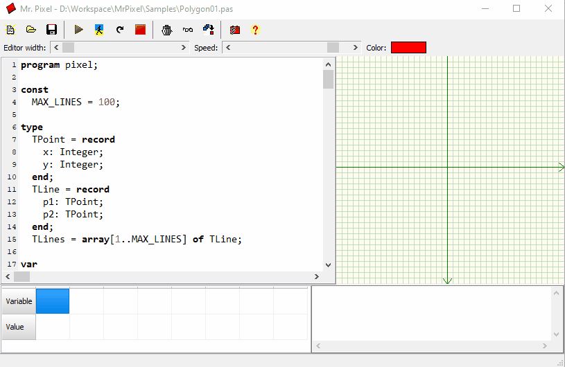

Mr. Pixel is a program written in Delphi by former student Branislav Stojković for the Computer Graphics course. Nearly two decades after its creation, it is still actively used in computer graphics classes.

The program allows you to write simple computer graphics algorithms in the Pascal programming language and visualize their execution pixel by pixel.

The last modifications to the project made by the author were recorded at the end of 2006. I have worked on releasing a new version, fixing bugs, enhancing features, and introducing new functionalities.

For more information, see *MrPixel.docx* or *Guides* and *Samples*.